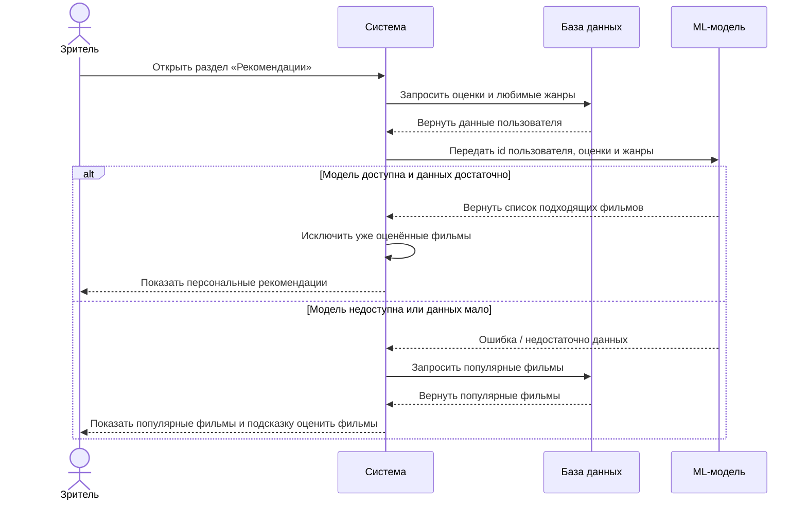
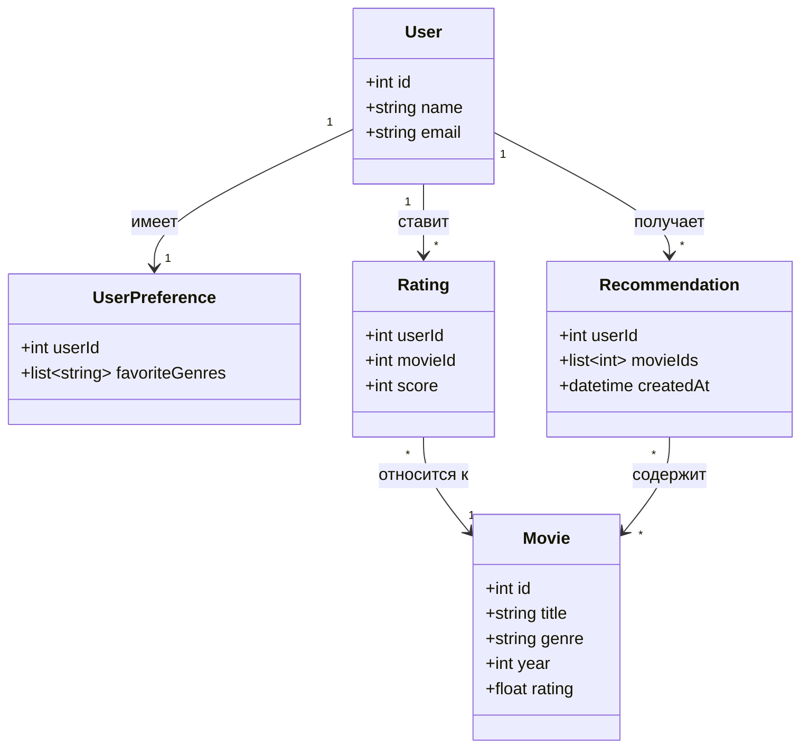

# Диаграммы

## Диаграмма последовательности

Диаграмма показывает сценарий UC-01 «Получение персональных рекомендаций».

```mermaid
sequenceDiagram
    actor User as Зритель
    participant System as Система
    participant DB as База данных
    participant Model as ML-модель

    User->>System: Открыть раздел «Рекомендации»
    System->>DB: Запросить оценки и любимые жанры
    DB-->>System: Вернуть данные пользователя
    System->>Model: Передать id пользователя, оценки и жанры

    alt Модель доступна и данных достаточно
        Model-->>System: Вернуть список подходящих фильмов
        System->>System: Исключить уже оценённые фильмы
        System-->>User: Показать персональные рекомендации
    else Модель недоступна или данных мало
        Model-->>System: Ошибка / недостаточно данных
        System->>DB: Запросить популярные фильмы
        DB-->>System: Вернуть популярные фильмы
        System-->>User: Показать популярные фильмы и подсказку оценить фильмы
    end
```

## Диаграмма классов

```mermaid
classDiagram
    class User {
        +int id
        +string name
        +string email
    }

    class UserPreference {
        +int userId
        +list~string~ favoriteGenres
    }

    class Movie {
        +int id
        +string title
        +string genre
        +int year
        +float rating
    }

    class Rating {
        +int userId
        +int movieId
        +int score
    }

    class Recommendation {
        +int userId
        +list~int~ movieIds
        +datetime createdAt
    }

    User "1" --> "1" UserPreference : имеет
    User "1" --> "*" Rating : ставит
    Rating "*" --> "1" Movie : относится к
    User "1" --> "*" Recommendation : получает
    Recommendation "*" --> "*" Movie : содержит
```
